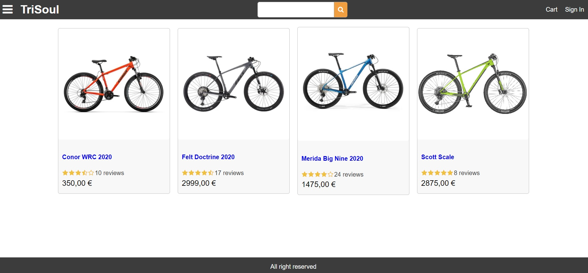

# TRISOUL-Triathlon-E-commerce-REACT-REDUX
***

## Table of Contents
1. [General Info](#general-info)
2. [Web Example](#web-example)
3. [Technologies](#technologies)
4. [Installation](#installation)
***




## 1. General Info
Personal learning project to build an ecommerce website, with the objective to learn the essential tools and skills to design, develop and deploy a fully-functional website using MERN stack.

The stack technologies used are: 
- HTML and CSS (grid, flex and responsive design)
- JAVASCRIPT
- REACT library to build the frontend (using REDUX library)
- NODE and EXPRESS framework to run web server and API endpoint
- MONGODB and MONGOOSE as a database
- Web deployed on HEROKU.

## 2. Web Example
You can view the app online here : 
https://trisoul.herokuapp.com/

```
adminName: admin@example.com
password: 1234
```

## 3. Technologies
A list of technologies used within the project:
* [REACT]: Version 17.0.1 
* [REACT-REDUX]: Version 7.2.2 
* [AXIOS]: Version 0.21.1
* [ESLINT]: Version 7.17.0
* [EXPRESS]: Version 4.17.1
* [NODEMON]: Version 2.0.7
* [BCRYPTJS]: Version 2.4.3
* [JSONWEBTOKEN]: Version 8.5.1
* [DOTENV]: Version 8.2.0
* [MONGOOSE]: Version 5.11.12
* [MONGODB-COMPASS]
* [MONGODB-ATLAS]
* [PAY-PAL]
* [AWS]
* [HTML-CSS]: Grid, Flex and responsive design

## 4. Installation
A little intro about the installation:

```
$ git clone https://github.com/vescartinq/TRISOUL-Triathlon-E-commerce-REACT-REDUX.git

backend:
$ npm install
$ npm start

frontend:
$ cd frontend
$ npm install
$ npm start
```
